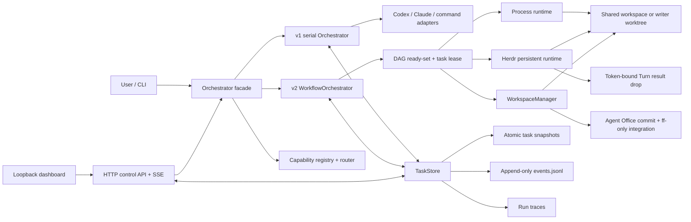

# Agent Office 架构

## 目标与兼容边界

Agent Office 的首要目标不是“同时启动多个模型”，而是为同一任务建立一个可恢复、可审计的协作事实源：

- 所有人知道同一个目标、角色、依赖和当前状态；
- 实现、审查、返工和用户决策形成显式交接；
- 执行进程中断后，不会把无法证明的工作当成完成；
- 写入项目、批准发布和集成目标分支各有独立边界。

0.4 同时支持两种任务模式：

| 模式 | 创建方式 | 调度模型 | 适用场景 |
| --- | --- | --- | --- |
| v1 串行轮次 | `task create` | 已路由的代理按固定顺序共享一个工作区；`run --rounds` 执行有限轮次 | 兼容已有任务和简单协作 |
| v2 工作流 | `workflow create --file ...` | DAG ready-set，最多并行 `maxConcurrency` 个节点 | 并行分析、隔离写入、审查、审批和发布 |

“v2”指持久化任务的 `version: 2` 与 `mode: "workflow"`。`agent-office.json` 和当前 workflow definition 的格式版本仍是 `version: 1`，因此旧配置不需要改成 `version: 2`。

## 组件



### v1 serial Orchestrator

创建串行任务时，能力路由器保存任务画像和代理、模型、推理强度及顺序的分配快照。后续轮次按这个快照运行，避免能力目录变化导致一个正在执行的任务中途换人。

每位代理通过适配器在同一个工作区完成一轮，返回 Turn Protocol 结果。点对点消息可以重新激活已经 `done` 的同事；`needsUser` 或发给 `user` 的消息会暂停任务。`run` 达到轮次上限时将任务恢复为 `ready`，之后可以继续运行。

这一模式保持原有语义，不获得 v2 的 worktree、节点 attempt token 或发布门保证。

### v2 WorkflowOrchestrator

工作流定义包含四种节点：

- `agent`：由配置中的代理执行；
- `command`：以参数数组启动本地命令，不经过 shell；
- `approval`：进入 `awaiting_approval`，只接受显式批准；
- `integration`：由 Agent Office 准备提交并发布唯一写 worktree。

节点默认是 `type: "agent"`、`access: "read_only"`、`workspace: "shared"`。agent 的 `maxAttempts` 默认是 2，其他节点默认是 1。`dependsOn` 定义有向无环图；存在环、未知依赖或未知 owner 的定义会在创建任务时被拒绝。

每次调度会先计算 ready-set：

1. 所有依赖都为 `succeeded` 的 `pending` 节点进入 `ready`；
2. 任一依赖为 `failed` 或 `skipped` 时，后代进入 `skipped`；
3. `approval` 从 `ready` 转为 `awaiting_approval`，不会被执行运行时领取；
4. 其他 ready 节点按定义顺序领取，数量不超过剩余 `maxConcurrency`；
5. 同一批节点通过 `Promise.all` 并行执行。

因此多个根节点可以 fan-out；依赖多个前驱的节点是严格 join barrier，只有全部前驱成功后才能启动。

节点状态如下：

```text
pending → ready → dispatched → working → succeeded
   │                              ├──→ blocked
   ├──→ skipped                   └──→ failed
   └──→ awaiting_approval → succeeded
```

任务在存在 `blocked` 或 `awaiting_approval` 且没有可运行节点时进入 `awaiting_input`；所有节点成功才是 `completed`。存在不可恢复的 `failed`/`skipped` 链时任务为 `failed`。

### Process 与 Herdr Runtime

工作流可以选择 `runtime: "process"` 或 `runtime: "herdr"`。未指定时继承 `execution.runtime`，默认是 `process`。

Process Runtime 对 `agent` 节点调用现有 Codex、Claude、command 或 mock 适配器；`command` 和 `integration` 节点无论工作流选择哪种 runtime，都由本地 Process Runtime 执行。

Herdr Runtime 只接管 `runtime: "herdr"` 工作流中的 `agent` 节点：

- 所有控制命令都带专用 `--session <herdrSession>`；
- 每个任务/节点使用确定且防碰撞的 agent 名称；
- 恢复时校验 kind、workspace、workspace ID、pane ID 和 agent session 身份；
- `external` 模式只连接已经运行的 server；`managed` 模式启动独立后台 server，并把 owner PID 与日志保存在 `stateDir`；
- managed server 启动时可用 `herdrPathPrefixes` 把绝对目录前置到 server 进程的 `PATH`，而不执行任意 shell 片段；登录 shell 或 agent launcher 仍可能重排 `PATH`，所以实际 CLI 与相邻 helper 的解析结果仍需要独立预检；
- agent 与 managed server 当前都会保留，工作流结束不会自动停止或删除它们。

Herdr 报告的进程状态不是节点完成证明。Runtime 只在 `idle`/`done` 时尝试结算；`blocked` 通常是权限或交互提示，会继续等待用户处理。Agent 仍必须写入当前 attempt 对应的 Turn Protocol result drop，且携带精确的 `attemptToken`。缺失、迟到或 token 不匹配的结果不会被接受。

### WorkspaceManager 与单写者策略

当前 workflow definition 在存在写节点时只允许一个 `access: "write"` 节点，并要求有且只有一个 `integration`；纯只读工作流不需要 integration。写入 agent 必须使用 `workspace: "worktree"` 并声明 `writeScopes`；只读 review/QA 节点可以用 `workspaceFrom` 读取这个 worktree，但必须直接依赖其来源节点。

工作区快照覆盖项目文件内容及 Git HEAD、分支和本地配置摘要，用于检查：

- `read_only` agent/command 节点是否产生任何项目变化；
- 写节点是否只修改 `writeScopes`；
- ignored 或其他 Git 无法发布的输出；
- 外部符号链接、越界或不存在的 artifact；
- agent 是否切换分支、修改本地 Git 配置或自行提交。

快照默认最多遍历 50,000 个文件。它是审计与 fail-closed 边界，不替代 Codex sandbox、Claude permission mode 或操作系统对网络和工作区外副作用的限制。

### 审查、批准与 ff-only 集成

平台强制的最小发布策略是：写节点之后必须存在一个 `approval`，该 gate 必须位于 `integration` 的依赖链上；integration 还必须直接依赖唯一写节点。

独立 reviewer 和 shell QA 是推荐且已在示例中使用的 DAG 节点，但不是验证器自动插入的隐式步骤。要实现“审查后批准”，应让 reviewer/QA 依赖 writer，再让 approval 同时依赖 writer、reviewer 和 QA：

```text
writer ──┬──→ reviewer ──┐
         ├──→ shell QA ──┼──→ approval ──→ integration ──→ optional main QA
         └───────────────┘
```

集成时，Agent Office 要求目标工作区干净，并执行以下动作：

1. 再次验证 worktree、Git 元数据与 write scopes；
2. 如果还没有准备好的提交，由 Agent Office 以固定消息创建唯一提交；
3. 拒绝 agent 自建提交；仅允许恢复 Agent Office 之前准备的精确单提交；
4. 将包含 base/source HEAD、精确 changed files 和目标工作区的 publication intent 原子持久化到任务快照；
5. 在目标工作区对精确 source HEAD 执行 `git merge --ff-only`；
6. 验证目标 HEAD 与准备好的 source HEAD 完全一致。

它不会 rebase、自动解决冲突、覆盖用户提交或合并多个写分支。目标分支分叉时，准备好的提交、worktree 和 publication intent 会保留供审计或恢复；修复目标分支关系后，可直接 retry 失败的 integration，且不会重复创建提交。上游节点被显式 rework 时，其下游 integration 也会随 DAG 一起重置。成功发布的 integration 不能重开。

### 重试、返工与恢复

节点返回 `status: "working"` 时，若仍有 `maxAttempts` 配额会再次进入 `ready`；配额耗尽则失败。返回 `blocked`/`needsUser` 时会等待用户决策。

`workflow retry` 可以处理：

- `blocked` 节点：回答决策后重新尝试；当提交结果的 `status` 明确为 `blocked` 时，会退还该阻塞 attempt 的一次配额；
- `failed` agent/command 节点：每次显式 retry 授权一次新的人工 attempt，即使历史 `attempts` 已达到或超过 `maxAttempts`，并重开被跳过的后代；
- 尚未成功发布的 `succeeded` agent/command 节点：每次显式 retry 授权一次 rework attempt，并重置其全部下游节点；
- 未成功发布的 `failed integration`：保留精确 intent 并重试幂等发布。

显式 retry 不会递减 `failed`、`succeeded` 或 `failed integration` 的历史 attempt 计数；只有明确返回 `blocked` 的结果会退还一次配额。超额人工 attempt 若仍返回 `working`，不会自动续跑。重开 writer 会让 review、QA、approval 和 integration 全部重新执行；最初 writer attempt 的 `integrationBaseline` 会保留，因此最终单一提交包含相对首次写入前基线的最终净变化，包括仍保留的早期 attempt 改动，而不是只比较最后一次修正。

`approval` 不能 retry；成功的 integration 以及其已经发布的上游不能重开。存在活动节点、活动后代 attempt 或有效任务租约时，retry 同样被拒绝。retry 只修改持久化状态，之后仍需再次执行 `run`。

每个工作流同一时间只有一个持久化 task lease，heartbeat 防止第二个调度器重复领取。每次节点执行还有独立 attempt token。重启恢复时，系统先接收已经提交且 token 有效的结果，再检查 Herdr binding；仍在工作的 Herdr agent 不会收到重复 prompt。失败后若 runtime 无法证明执行器已经停止，继承 writer worktree 的节点会立即把该 worktree 标记为 tainted，阻止后续 integration；系统不会用一次过早快照把潜在的晚写入当作安全状态。

### TaskStore 与外部控制状态

TaskStore 使用进程间目录锁串行化写入：任务快照先写临时文件再原子 rename，事件追加到 `events.jsonl`。状态目录包含：

```text
<stateDir>/
├── .write-lock/                  # 仅在持有写锁时存在
├── events.jsonl                  # append-only 事件
├── runs/                         # 适配器、命令和 Herdr trace
├── tasks/<task-id>.json          # 原子任务快照
├── herdr-server.log              # managed Herdr 模式按需产生
└── herdr-server-owner.json       # managed Herdr owner 记录
```

`agent-office init` 默认生成 `~/.local/state/agent-office/<workspace-key>` 形式的外部绝对路径。创建 v2 工作流时，控制状态若位于 executor workspace 内或与其相同会被拒绝，使任务、lease、attempt token 和审批记录不落入正常的项目写入面。这个路径边界仍需配合底层工具 sandbox/permission mode；它不是操作系统级访问控制。旧串行任务仍兼容显式配置的工作区内 `.agent-office`，但新项目应使用外部目录。

### Local dashboard 与控制 API

`agent-office serve` 只监听 `127.0.0.1`、`localhost` 或 `::1`。dashboard 和 CLI 使用同一 TaskStore 与 Orchestrator，不存在第二套状态机。

只读接口：

- `GET /api/health`
- `GET /api/capabilities`
- `GET /api/tasks`
- `GET /api/tasks/<task-id>`
- `GET /api/events?limit=<n>`
- `GET /api/stream`（SSE）

控制接口：

- `POST /api/capabilities/refresh`
- `POST /api/tasks`（创建 v1 串行任务）
- `POST /api/tasks/<task-id>/messages`
- `POST /api/tasks/<task-id>/run`
- `POST /api/tasks/<task-id>/nodes/<node-id>/approve`
- `POST /api/tasks/<task-id>/nodes/<node-id>/retry`

当前 API 没有 workflow-definition 创建端点；v2 工作流仍由 CLI 从本地 JSON 文件创建。服务拒绝非 loopback Host、跨站写请求和超过 64 KiB 的 JSON 正文，也不提供任意命令编辑接口。

需要从手机操作时，应让手机端 SSH/Tailscale SSH 客户端建立本地端口转发，而不是把 dashboard 暴露到 `0.0.0.0`：

```bash
ssh -N -L 4177:127.0.0.1:4177 user@your-mac
```

随后在建立转发的设备打开 `http://127.0.0.1:4177`。

### 工具自身掌管认证

Agent Office 不保存 Codex、Claude 或 Herdr 凭据，也不尝试绕过权限。适配器调用本机工具，认证、模型访问、网络权限和组织策略仍由工具本身控制。command 节点只继承 `PATH` 和定义中 `env` 明确列出的环境变量名，不会持久化这些变量的值。

## 仍有意不做的范围

1. 多写者 worktree 的自动合并、rebase 与冲突解决；
2. 跨机器 worker、中心调度服务以及直接公网暴露的 dashboard；
3. 按文件、命令、成本或外部副作用配置的组织级审批策略；
4. 自动清理 worktree、Herdr agent 或 managed server；
5. 长期知识库、上下文压缩器和 provider 级真实成本核算。
