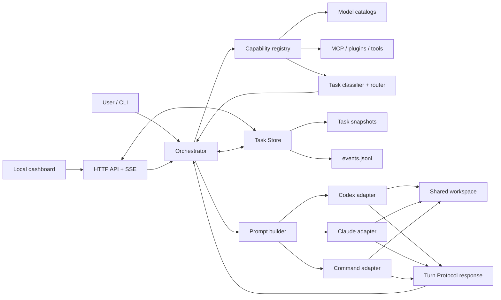

# Agent Office 架构

## 目标

Agent Office 的首要目标不是“同时启动多个模型”，而是为同一任务建立一个可靠的协作事实源：

- 所有人知道同一个目标；
- 每位代理知道自己的角色和同事状态；
- 实现、审查和返工形成可观察的交接；
- 用户能在需要决策时介入；
- 一次中断不会丢失任务和对话。

## 组件



### Orchestrator

调度器负责轮次、停止条件和状态转换，不负责替代理决定具体实现。创建任务时，能力路由器先保存任务画像和分配快照；后续轮次严格按快照中的代理、模型、推理强度和顺序执行。

### Capability registry 与 router

能力注册表只做无费用、只读探测：

- CLI 版本决定代理执行入口是否可用；
- Codex 从本机/内置模型目录读取模型描述、输入模态和推理档位；
- Claude 从 CLI 帮助、显式配置和模型环境变量读取候选模型；
- 两边的 MCP、Claude 插件和配置工具合并为标准化工具 ID；
- 无法从 CLI 确认账号授权的模型使用 `advertised` 或 `configured` 标记，和已进入本机目录的 `catalog` 模型分开。

任务分类器把目标映射为 `coding`、`review`、`reasoning`、`research`、`writing`、`vision`、`speed` 和 `costEfficiency` 权重，并产生必需工具列表。路由器对每个代理/模型组合打分，应用角色匹配与工具缺口修正，选出最多 `routing.maxAgents` 个执行者。

路由结果作为任务事实的一部分持久化，而不是每轮重新计算。这样模型目录变化不会让一个正在进行的任务中途换人；新任务会使用刷新后的能力事实。

任务主要状态：

```text
ready → running → completed
            ├──→ awaiting_input → ready
            ├──→ failed
            └──→ ready  (达到本次轮次上限或被中断，可继续 run)
```

代理主要状态：

```text
idle → working → done
          ├──→ blocked
          └──→ failed

done --收到同事直接消息--> working
```

### Task Store

每个任务有独立 JSON 快照，写入使用：

1. 获取进程间目录锁；
2. 写临时文件；
3. 原子 rename；
4. 向 `events.jsonl` 追加事件；
5. 释放锁。

这让多个 CLI 进程发送消息时不会覆盖状态。锁等待有上限，不会无限挂起。

### 运行租约

写锁保护的是单次状态写入，无法阻止两个进程交替推进同一个任务。因此每次运行会额外持有一份运行租约（`leases/<task-id>.json`），记录进程号、主机名和心跳时间：

- 同一任务同时只允许一个运行者，第二个进程立即失败并给出持有者信息；
- 心跳过期或进程已消失的租约会被下一次运行自动接管；
- 由此，被强制杀死的运行留下的 `running` 任务可以被识别为"过期运行"并直接恢复，而不是永久卡死。

租约是**运行期**事实，不进入任务快照；任务快照仍然只描述协作进度本身。

### 取消

`AbortSignal` 从编排器穿过适配器传到子进程：中断时先 `SIGTERM`、0.5 秒后 `SIGKILL`，释放租约并把任务置回 `ready`。被中断的代理**不会**被标记为 `failed`——中断是用户决定，不是代理错误，因此已完成的回合、消息和产物全部保留。

### Local dashboard

`agent-office serve` 在 loopback 地址启动零依赖 HTTP 服务：

- REST API 读取任务、事件、能力目录和运行时指标；
- 写 API 创建任务、发送消息和异步启动任务；
- SSE 推送编排事件与文件状态变化；
- 单页控制台展示任务、路由计划、模型/工具、代理、消息、最新输出和运行事件。

写请求要求同源，正文限制为 64 KiB，并设置严格 CSP。服务不允许绑定非 loopback 地址；远程访问需要未来单独设计认证和权限边界。

### Adapters

适配器只有一个核心职责：

```js
runTurn({ prompt, workspace, timeoutMs, model, effort, signal, onProgress })
```

`signal` 用于取消，`onProgress` 用于回合内的实时进度。适配器另外返回归一化的 `usage`（token 恒有，费用仅在提供方报告时存在）。

返回标准化的 Turn Protocol 结果和原始输出路径。内置适配器：

- `codex`：调用 `codex exec --json`，使用 `--output-schema` 和 workspace sandbox；最终结果取自 `--output-last-message`，进度与 token 用量取自 JSONL 事件。
- `claude`：调用 `claude -p --output-format stream-json`，使用 `--json-schema`；最终结果、token 与费用取自流末的 `result` 事件。
- `command`：调用任意可执行程序，prompt 通过 stdin 传入。
- `mock`：离线、确定性的测试和演示适配器。

所有进程均通过参数数组启动，`shell=false`。

## 关键决策

### 串行轮次优先

首版在同一工作区串行运行代理。这样同事能看到前一位的真实文件状态，并避免并发覆盖。未来的并行执行应先为每位代理创建隔离 worktree，再通过受审合并进入共享分支。

### 结构化消息而非抓取自然语言

代理最终输出遵循 JSON Schema。`messages` 提供明确收件人，`status` 和 `needsUser` 提供停止信号。若第三方工具无法严格输出 JSON，解析器会保留其纯文本为 `working` 摘要，避免直接丢失工作。

### 控制面与执行解耦

`run` 仍然一次执行有限轮次，状态落盘后退出；`serve` 只提供本地控制面，并通过相同 Orchestrator 异步启动有限运行。CLI 和控制台共享任务事实源与协议，不存在两套行为。

### 工具自身掌管认证

Agent Office 不保存 Codex 或 Claude 凭据，也不尝试绕过权限。适配器调用本机工具，认证、模型访问和组织策略仍由工具本身控制。

## 扩展路线

1. worktree 执行器：每个代理隔离分支，合并前运行检查。
2. 审批策略：按文件、命令、成本和外部写操作设置 gate。
3. 远程 worker：在认证和加密边界内使用相同 Turn Protocol 接入容器或其他机器。
4. 上下文压缩器：对长任务生成经过引用的共享工作记忆。
5. 成本与性能监控：接入真实 provider 用量、延迟和错误率。
6. 更细审批视图：在控制台展示命令、差异、产物和人工 gate。
