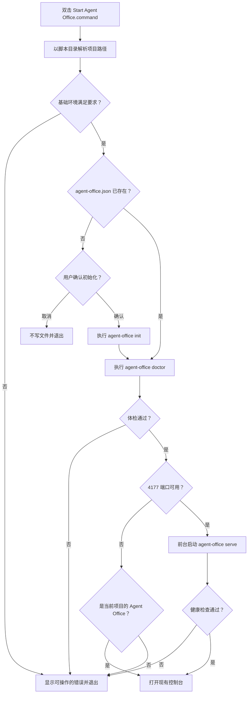

# Agent Office 一键启动器与桌面壳实施计划

状态：**阶段 0 已实现；Finder 一键脚本与桌面壳仍在规划中**

首要平台：**macOS**

当前优先级：先通过 `agent-office start` 收集真实使用反馈，再决定是否交付 Finder 一键脚本和原生桌面壳。

## 1. 目标

让用户在 Finder 中进入一个项目后，通过双击完成以下流程：

1. 检查本机环境是否满足 Agent Office 的运行要求；
2. 检查项目是否已经初始化；
3. 未初始化时取得用户确认，再生成起始配置；
4. 对当前配置执行环境体检；
5. 启动本地控制台服务；
6. 等待服务真正可用后，自动在浏览器中打开控制台。

第一阶段的目标是**不需要用户输入命令**，而不是立即交付一个完整的原生桌面应用。现有编排器、HTTP API 和 dashboard 继续作为唯一业务实现，启动器只负责项目发现、初始化确认、环境检查和进程生命周期。

## 2. 分阶段路线

### 阶段 0：项目目录内的一条命令（已实现）

用户先进入目标项目，然后只运行 `agent-office start`。命令检查配置，必要时请求确认并初始化，执行 `doctor`，启动控制台，并在监听成功后打开浏览器。Terminal 继续作为服务的进程宿主。

### 阶段 A：项目内一键启动脚本（首个实施切片）

在项目根目录放置一个可双击的 `Start Agent Office.command`。脚本以自身所在目录作为工作区，完成预检、初始化确认、`doctor`、`serve` 和打开浏览器。

这一阶段允许 Terminal 窗口作为后台服务的进程宿主，但用户不需要在窗口中输入任何命令。窗口应清楚显示启动状态和错误；关闭窗口或中断前台进程即停止控制台服务。

### 阶段 B：轻量项目启动器

增加“最近项目”和文件夹选择能力，不再要求每个项目各放一份脚本。启动器记住项目路径，复用阶段 A 的检查和启动逻辑。

### 阶段 C：原生桌面壳

以 SwiftUI + `WKWebView` 包装现有 dashboard，接管服务进程、项目切换、退出确认和系统通知。此阶段才实现完全不显示 Terminal 的桌面体验。

## 3. 阶段 A 的用户流程



## 4. 功能需求

### 4.1 项目解析

- 工作区必须取脚本文件自身所在目录，而不是 Finder 或 Terminal 偶然提供的当前目录。
- 所有路径必须支持空格、中文和特殊字符。
- 启动时打印最终解析出的工作区和配置路径，便于用户确认没有打开错误项目。
- 第一阶段一次只管理一个项目，不做多项目并行启动。

### 4.2 基础环境检查

初始化前先做不依赖项目配置的检查：

- macOS 版本受支持；
- `node` 可执行，且主版本不低于 20；
- 能找到 `agent-office` 命令，或找到明确配置的 Agent Office 安装路径；
- 项目目录可读写；
- 不使用 `sudo`，不自动安装软件，不修改全局 PATH。

基础检查失败时必须给出具体修复提示，例如“未找到 Node.js”或“Agent Office 未安装”，不能只显示“启动失败”。

### 4.3 初始化确认

- 若 `agent-office.json` 已存在，直接读取，绝不覆盖。
- 若配置不存在，使用 macOS 原生确认对话框说明将创建的文件和默认代理（Codex + Claude）。
- 用户确认后才执行现有的 `agent-office init <project>`。
- 用户取消时不得留下空配置、状态目录或半写入文件。
- 初始化完成后，可单独询问是否把以下模式加入项目 `.gitignore`；未经确认不修改：

  ```gitignore
  .agent-office/
  .agent-office.lock*
  ```

- `.gitignore` 更新必须幂等，已有规则不能重复添加。

### 4.4 配置级体检

初始化完成或读取已有配置后，执行现有 `agent-office doctor --config <path>`：

- 按配置检查实际启用的 Codex、Claude 或自定义代理；
- 显示 CLI 缺失、未登录、版本不兼容、模型或工具探测失败等信息；
- `doctor` 失败时默认不启动真实项目服务；
- 不自动登录、不读取或保存 API key；
- Terminal 保留完整诊断输出，同时用简短对话框告诉用户下一步做什么。

### 4.5 服务启动与复用

- 默认地址保持 `http://127.0.0.1:4177`，不允许绑定非 loopback 地址。
- 启动前探测 4177 端口：
  - 若空闲，启动当前项目的 `agent-office serve`；
  - 若已有服务且健康信息中的工作区与当前项目一致，直接复用并打开页面；
  - 若被其他项目或其他程序占用，显示冲突信息并退出，不擅自终止进程。
- `serve` 必须以前台子进程运行，使 Terminal 窗口成为明确的生命周期所有者。
- 脚本退出或收到中断信号时，应把信号转发给服务并等待其安全关闭。
- 第一阶段不把服务静默留在后台，也不创建无人管理的 PID 文件。

### 4.6 就绪检查与打开浏览器

- 不能在启动子进程后立刻盲目打开页面。
- 应轮询 Agent Office 的本地健康接口，确认响应中的工作区与当前项目一致。
- 就绪等待必须有短且明确的 deadline；超时后打印服务日志摘要并退出。
- 健康检查成功后调用 macOS `open` 打开实际地址。
- 浏览器打开失败不应杀死已经正常运行的服务，应显示可以手工复制的本地地址。

### 4.7 用户可见状态

Terminal 窗口至少显示以下阶段：

```text
正在检查环境…
正在检查项目配置…
正在运行 Agent Office 体检…
正在启动本地服务…
控制台已就绪：http://127.0.0.1:4177
关闭此窗口将停止 Agent Office。
```

错误信息必须包含失败阶段、原始错误摘要和建议动作。不能弹出“成功”后才发现服务没有监听。

## 5. 安全与可靠性要求

- 所有外部程序都必须以参数数组调用，禁止把项目路径拼进可执行 shell 字符串。
- 不使用 `eval`，不执行项目文件提供的任意命令。
- 不自动覆盖 `agent-office.json`，不自动删除租约或工作区锁。
- 不把凭据、模型输出或状态目录提交进 Git。
- 不放宽 Codex 的 `workspace-write` 或 Claude 的 `acceptEdits` 默认权限。
- 初始化、`.gitignore` 更新等持久化写入必须发生在用户确认之后。
- 端口复用必须验证工作区身份，不能因为 4177 返回任意 HTTP 响应就打开。
- 脚本与未来桌面壳不得绕过现有的任务租约、工作区锁和 fence。

## 6. 建议的实现边界

为了保持脚本小且可测试，阶段 A 建议拆成两层：

- `Start Agent Office.command`：只负责定位脚本目录、检查 Node，并启动下面的 Node 程序；
- 一个使用 Node.js 内置模块实现的 launcher：负责确认对话框、调用现有 CLI、健康检查、信号转发和打开浏览器。

这样可以复用项目现有的 Node 版本要求与进程管理习惯，避免把复杂状态机堆进难以测试的 shell 脚本。具体文件名和安装位置在实施前固定，不在本计划阶段创建占位代码。

## 7. 验收标准

阶段 A 只有同时满足以下条件才算完成：

1. 在含空格和中文路径的项目中双击可正常启动；
2. 缺少 Node、Agent Office、Codex 或 Claude 时给出对应诊断，不产生半初始化状态；
3. 未初始化项目会先确认，取消后零写入；
4. 确认后只创建预期配置，已有配置绝不被覆盖；
5. `doctor` 失败时不把不可用环境伪装成成功；
6. 服务健康后才打开浏览器，打开的是正确工作区；
7. 同项目已有服务时复用，不启动第二份；
8. 端口被其他程序占用时不杀进程、不打开错误页面；
9. 关闭或中断 launcher 后，服务和由其直接持有的进程按现有取消语义退出；
10. 使用启动器创建、运行、停止、恢复一个真实任务后，任务状态与 CLI 启动时一致；
11. 现有 CLI 行为与完整测试套件保持通过；
12. 文档明确说明第一阶段仍有 Terminal 进程窗口，不能宣称已经是原生桌面 App。

## 8. 验证计划

实施时至少覆盖：

- 临时项目：已有配置、无配置、取消初始化、初始化成功；
- fake `node` / `codex` / `claude`：缺失、错误版本、非零退出；
- 工作区路径含空格、中文和 shell 元字符；
- 4177 空闲、同项目服务已运行、其他程序占用；
- 服务启动成功、启动后立即退出、健康检查超时；
- 浏览器打开失败但服务仍存活；
- SIGINT、关闭 Terminal 与正常退出的子进程清理；
- macOS Finder 双击的人工 QA；
- 完整 `npm run check` 回归。

## 9. 非目标

阶段 A 不包含：

- 自动安装或登录 Node、Codex、Claude；
- Windows/Linux 启动器；
- 多项目同时运行；
- 静默常驻后台、登录项或自动更新；
- 在 UI 中编辑所有高级配置；
- 自动 commit、merge 或 push；
- 原生通知、Dock 菜单或菜单栏图标；
- 打包、签名、公证和发布 `.app`。

这些能力应在阶段 B/C 中按真实使用反馈逐项提升，而不是扩大第一阶段的一键启动脚本。

## 10. 实施前需要固定的决定

1. 一键脚本是复制到每个项目根目录，还是由 Agent Office 提供“为此项目安装启动器”的动作；
2. 第一阶段是否只支持全局 `agent-office` 命令，还是允许配置安装目录；
3. `.gitignore` 是否在初始化确认中默认勾选；
4. Terminal 窗口关闭时，是停止服务还是弹出二次确认；
5. 阶段 B 优先做最近项目列表，还是直接进入 SwiftUI 桌面壳。

推荐默认值是：**项目根目录放置启动器、优先使用全局命令、单独确认 `.gitignore`、关闭窗口即停止服务、先观察阶段 A 的使用反馈再决定阶段 B/C。**
